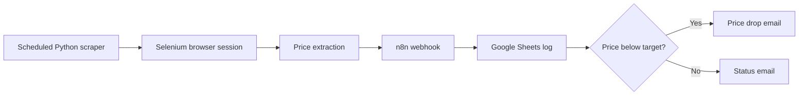

# Competitor Price Monitor


A production-style price monitoring automation for competitor products. The Python scraper opens JavaScript-heavy product pages with Selenium, extracts the current price, compares it with a target price, and sends a structured payload to n8n. The included workflow records the latest snapshot in Google Sheets and sends email alerts when the price drops below the target.

## What This Project Does

- Scrapes dynamic e-commerce pages that regular HTTP requests may not render correctly.
- Extracts prices with a configurable CSS selector and resilient numeric parsing.
- Builds a clean JSON payload with product name, price, currency, URL, target price, alert type, and timestamp.
- Sends the payload to an n8n webhook for Google Sheets logging and Gmail notifications.
- Includes documentation, example payloads, workflow setup notes, validation scripts, and GitHub Actions CI.

## Architecture



## Repository Structure

```text
.
+-- src/
|   +-- price_monitor.py
+-- workflow/
|   +-- competitor-price-monitor.json
|   +-- README.md
+-- docs/
|   +-- PAYLOAD.md
|   +-- SETUP.md
|   +-- TROUBLESHOOTING.md
|   +-- WORKFLOW.md
+-- examples/
|   +-- payload.example.json
+-- scripts/
|   +-- validate-project.js
+-- requirements.txt
+-- .env.example
```

## Quick Start

```bash
git clone https://github.com/abuzar561/Competitor-Price-Monitor.git
cd Competitor-Price-Monitor
python -m venv .venv
```

Windows PowerShell:

```powershell
.\.venv\Scripts\Activate.ps1
pip install -r requirements.txt
$env:PRODUCT_URL = "https://example.com/product"
$env:PRICE_SELECTOR = ".price"
$env:PRODUCT_NAME = "Competitor Product"
$env:TARGET_PRICE = "999"
python src/price_monitor.py --dry-run
```

macOS or Linux:

```bash
source .venv/bin/activate
pip install -r requirements.txt
PRODUCT_URL="https://example.com/product" \
PRICE_SELECTOR=".price" \
PRODUCT_NAME="Competitor Product" \
TARGET_PRICE="999" \
python src/price_monitor.py --dry-run
```

Remove `--dry-run` after you configure `N8N_WEBHOOK_URL`.

## Configuration

| Variable | Required | Description |
| --- | --- | --- |
| `PRODUCT_URL` | Yes | Product page URL to monitor. |
| `PRICE_SELECTOR` | Yes | CSS selector for the price element. |
| `PRODUCT_NAME` | No | Friendly product name used in logs and emails. |
| `TARGET_PRICE` | No | Alert threshold. Defaults to `999`. |
| `CURRENCY` | No | Currency label. Defaults to `PKR`. |
| `N8N_WEBHOOK_URL` | Required outside dry-run | n8n production webhook URL. |
| `WAIT_SECONDS` | No | Selenium wait timeout. Defaults to `20`. |
| `USER_AGENT` | No | Custom browser user agent string. |

See [.env.example](.env.example) for a complete template.

## n8n Workflow

Import [workflow/competitor-price-monitor.json](workflow/competitor-price-monitor.json) into n8n, connect your Google Sheets and Gmail credentials, then replace the placeholder sheet and email values. The default template updates one row per product URL; switch the Google Sheets node to append mode if you want full price history. The workflow is sanitized for public GitHub use and does not include personal credentials or webhook IDs.

Detailed workflow instructions are in [docs/WORKFLOW.md](docs/WORKFLOW.md).

## Example Payload

```json
{
  "product_name": "Competitor Product",
  "price": 899,
  "currency": "PKR",
  "url": "https://example.com/product",
  "target_price": 999,
  "alert_type": "price_drop",
  "timestamp": "2026-05-02T08:00:00+00:00"
}
```

## Validation

Run the repository checks before publishing changes:

```bash
node scripts/validate-project.js
python -m py_compile src/price_monitor.py
```

GitHub Actions runs the same checks on every push and pull request.

## Responsible Use

Use this project only on websites where you have permission to automate access. Respect robots.txt, terms of service, request limits, and regional data rules. Add delays or scheduling windows that are appropriate for the target site.

## License

This project is licensed under the [MIT License](LICENSE).
